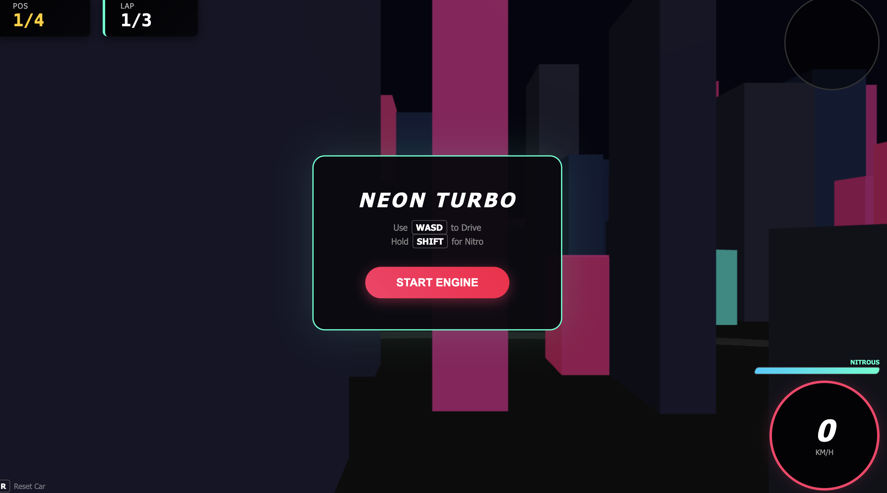
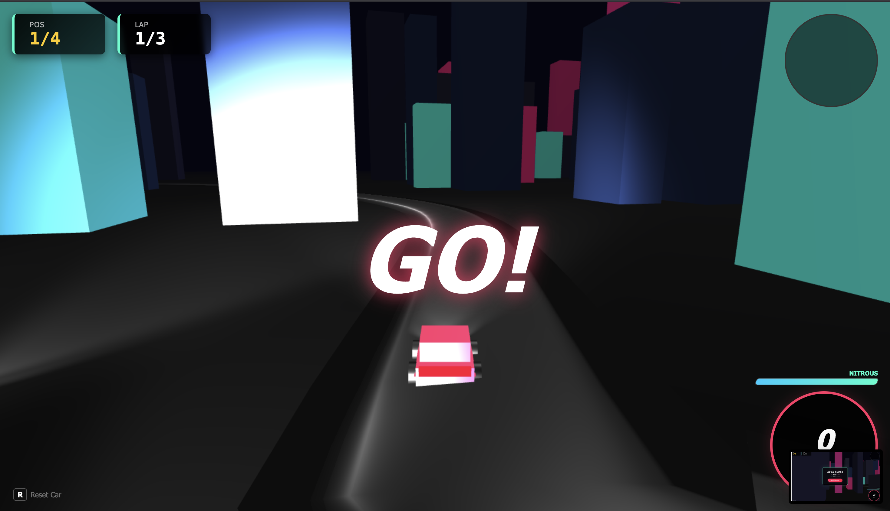
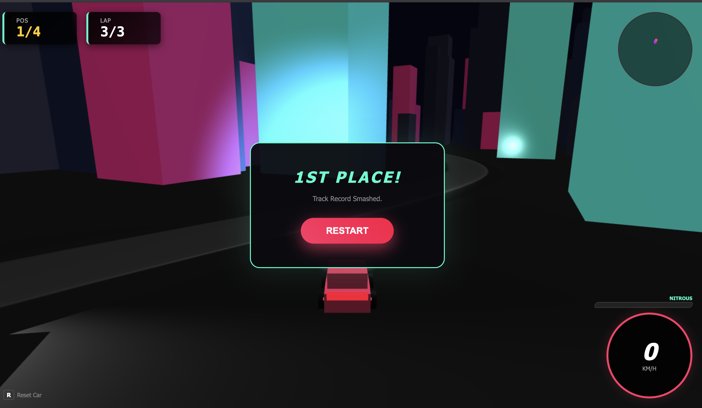

<div align="center">

# 🏎️ Poly City Racer: Turbo

### *High-Octane 3D Racing in a Neon Cyberpunk City*

[](https://bhanu2006-24.github.io/racing-game/)
[](https://threejs.org/)
[](https://developer.mozilla.org/en-US/docs/Web/JavaScript)
[](LICENSE)

### **[🚀 PLAY NOW →](https://bhanu2006-24.github.io/racing-game/)**

</div>

---

## 🎬 Game Preview

<div align="center">

### 🏁 Race Menu


*Dynamic menu with neon cyberpunk aesthetics*

---

### ⏱️ Countdown Intensity


*Ready... Set... GO!*

---

### 🏆 Victory Celebration


*Cross the finish line first and claim your victory!*

</div>

---

## ✨ Features at a Glance

<table>
<tr>
<td width="50%">

### 🌃 **Immersive 3D World**
- 350+ procedurally generated buildings
- Neon-lit cyberpunk skyscrapers
- Dynamic fog & professional lighting
- Smooth curved racing track

</td>
<td width="50%">

### 🏁 **Competitive Racing**
- 3 AI opponents with unique strategies
- 3-lap championship race
- Real-time position tracking
- Smart collision avoidance

</td>
</tr>
<tr>
<td width="50%">

### 🚗 **Advanced Physics**
- Realistic car dynamics
- Nitrous boost system
- Drift mechanics
- Building collision detection

</td>
<td width="50%">

### 🎨 **Premium Visuals**
- Real-time minimap
- Particle effects (drift/nitro)
- Dynamic camera with FOV shifts
- Cyberpunk color palette

</td>
</tr>
</table>

---

## 🎮 Controls

<div align="center">

| Key | Action | Key | Action |
|:---:|:------|:---:|:------|
| `W` / `↑` | **Accelerate** | `S` / `↓` | **Brake/Reverse** |
| `A` / `←` | **Turn Left** | `D` / `→` | **Turn Right** |
| `SHIFT` | **Nitrous Boost** 🔥 | `SPACE` | **Brake** |
| `R` | **Reset Car** | - | - |

</div>

---

## 🚀 Quick Start

### Option 1: Play Online
```
🌐 https://bhanu2006-24.github.io/racing-game/
```

### Option 2: Run Locally

```bash
# Clone the repository
git clone https://github.com/bhanu2006-24/racing-game.git
cd racing-game

# Open directly in browser
open index.html
```

### Option 3: Local Server

```bash
# Using Python 3
python -m http.server 8000

# Using Node.js
npx http-server -p 8000

# Then visit: http://localhost:8000
```

---

## � Pro Tips

<div align="center">

| Tip | Strategy |
|-----|----------|
| 🏃 **Start Strong** | Lead from lap one to control the race |
| 🌀 **Drift Smart** | Use controlled drifts to maintain corner speed |
| ⚡ **Nitro Timing** | Save boosts for straightaways, not corners |
| 🏗️ **Avoid Buildings** | Collisions reverse momentum - stay on track! |
| 🗺️ **Watch Minimap** | Track opponent positions strategically |

</div>

---

## 🛠️ Technical Stack

<div align="center">

| Technology | Purpose |
|:----------:|:--------|
|  | 3D Graphics Engine |
|  | Game Logic & Physics |
|  | Page Structure |
|  | UI & HUD Design |

</div>

### Architecture Highlights

```
🎮 Game Engine
├── CarController class → Physics, AI, player input
├── ParticleSystem class → Visual effects
├── Track generation → Catmull-Rom curves
└── City generation → Procedural buildings

⚙️ Systems
├── Physics → Velocity, friction, collision
├── AI → Pathfinding, speed variation, avoidance
└── Racing → Lap tracking, position calculation
```

---

## 🎨 Customization Guide

<details>
<summary><b>🎨 Change Car Colors</b></summary>

```javascript
const COLORS = [0xff3366, 0x00ccff, 0xccff00, 0xcc00ff];
// Player ↑    AI1 ↑       AI2 ↑       AI3 ↑
```
</details>

<details>
<summary><b>🏎️ Adjust Physics</b></summary>

```javascript
this.acceleration = 0.035;   // Acceleration rate
this.maxSpeed = 2.4;         // Maximum speed
this.turnSpeed = 0.045;      // Turn rate
this.nitroMaxSpeed = 3.5;    // Nitro max speed
```
</details>

<details>
<summary><b>🏁 Modify Race Settings</b></summary>

```javascript
const TOTAL_LAPS = 3;        // Number of laps
const TRACK_SCALE = 1.2;     // Track size multiplier
```
</details>

---

## 🗺️ Roadmap

### 🎯 Upcoming Features

- [ ] 🎵 Sound effects & background music
- [ ] 🏆 Multiple tracks & difficulty levels
- [ ] ⚡ Power-ups & boost pads
- [ ] 💾 Save/load race records
- [ ] 🎯 Time trial mode
- [ ] 📱 Mobile touch controls
- [ ] 🌐 Multiplayer racing (WebRTC)

---

## � Project Structure

```
racing-game/
│
├── 📄 index.html       # Main game file (self-contained)
├── 📁 public/          # Screenshot assets
│   ├── start.png
│   ├── go.png
│   └── won.png
├── 📖 README.md        # This file
├── 📜 LICENSE          # MIT License
└── 🚫 .gitignore       # Git ignore rules
```

---

## 🤝 Contributing

<div align="center">

Contributions are welcome! Here's how you can help:

[](https://github.com/bhanu2006-24/racing-game/fork)
[](https://github.com/bhanu2006-24/racing-game/issues)
[](https://github.com/bhanu2006-24/racing-game/pulls)

</div>

### Development Workflow

1. **Fork** the repository
2. **Create** a feature branch
   ```bash
   git checkout -b feature/amazing-feature
   ```
3. **Commit** your changes
   ```bash
   git commit -m 'Add amazing feature'
   ```
4. **Push** to the branch
   ```bash
   git push origin feature/amazing-feature
   ```
5. **Open** a Pull Request

---

## 📄 License

<div align="center">

This project is licensed under the **MIT License**

See [LICENSE](LICENSE) file for details

[](LICENSE)

</div>

---

## 👨‍💻 Author

<div align="center">

**Bhanu Pratap Saini**

[](https://github.com/bhanu2006-24)
[](https://linkedin.com/in/bhanu-saini-3bb251391)

</div>

---

## 🙏 Acknowledgments

<div align="center">

🌟 **Three.js Team** - Amazing 3D graphics library  
🎮 **Classic Arcade Racers** - Inspiration and nostalgia  
🌃 **Cyberpunk Aesthetic** - Visual design inspiration  

</div>

---

<div align="center">

### 🌟 Show Your Support

**If you enjoyed this game, give it a ⭐️!**

### Ready to race? 🏁

**[PLAY NOW →](https://bhanu2006-24.github.io/racing-game/)**

---

*Built with ❤️ and ☕ by [Bhanu Pratap Saini](https://github.com/bhanu2006-24)*

</div>
